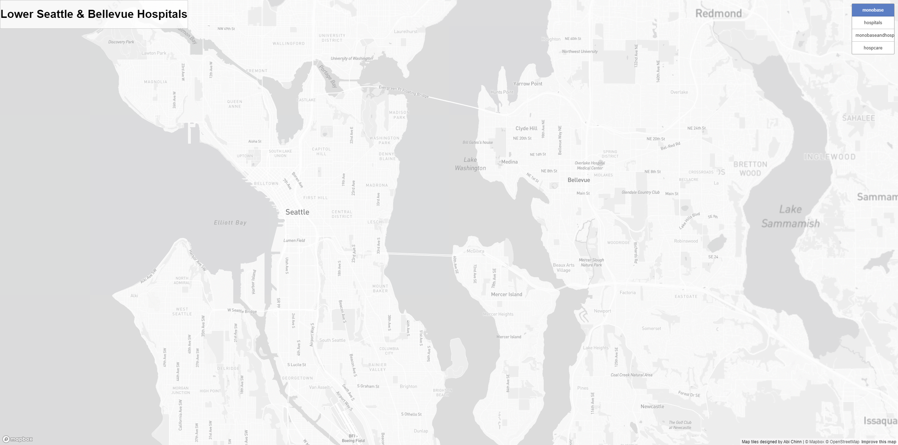
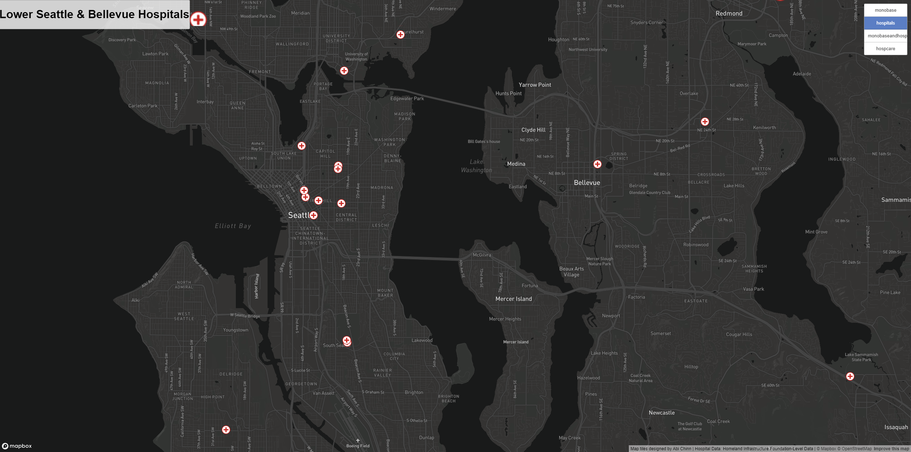
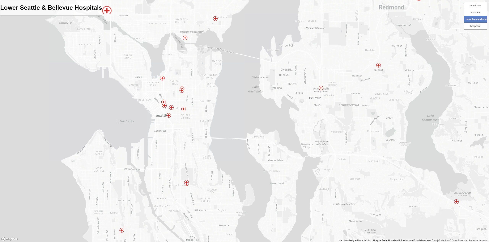
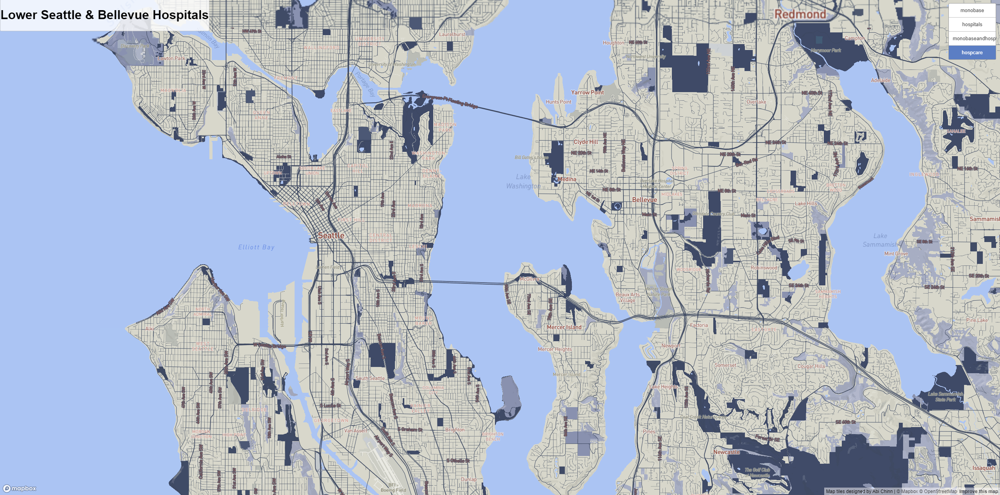

# Lab 4: Map Design and Tile Generation

For Lab 4 for GEOG 458, I decided to examine the area of lower Seattle and Bellevue, WA. Additionally, within these boundaries, we also look at the geographic area, Mercer Island. All of these maps were made at the same zoom level for each tile set, being a scale of 1:91,992 in QGIS, and thus this same level is readily available in my created map [here](https://abich1.github.io/geog-458-lab-4/).

brief descriptions of each tile sets (3 POINTS).

## Tile Sets:

**First tile set:** monochrome color scheme basemap

This first tile set is a basemap showing the geographical context of the area I am looking at. It has a monochrome color scheme having a light gray color scheme, slightly darker than the existing MapBox layer with text all changed to the Barlow family in varying boldness.

**Second tile set:** hospital thematic layer

This second tile set depicts the same geographical area as the first with just hospital point data, being a thematic layer from a dataset. The data comes from [Homeland Infrastructure Foundation-Level Data](https://hifld-geoplatform.opendata.arcgis.com/datasets/geoplatform::hospitals/about) and is from GeoPlatform ArcGIS Online published in 2023.

**Third tile set:** monochrome color scheme basemap with hospital thematic layer

This third tile set is a combination of the first two maps, the thematic layer and basemap.

**Fourth tile set:** hospital care theme map layer

This fourth tile set is a map layer designed with MapBox. It has a color theme of colors that you may see in a hospital with the red text and blue colors. In order to make the map more visually appealing, the dark creme color is added, a color of walls from a picture of a hospital I inputted into MapBox to not create a solely red and blue map. I created a visually appealing map that was not too on the nose in terms of colors, and was inspired by the inside of a hospital.